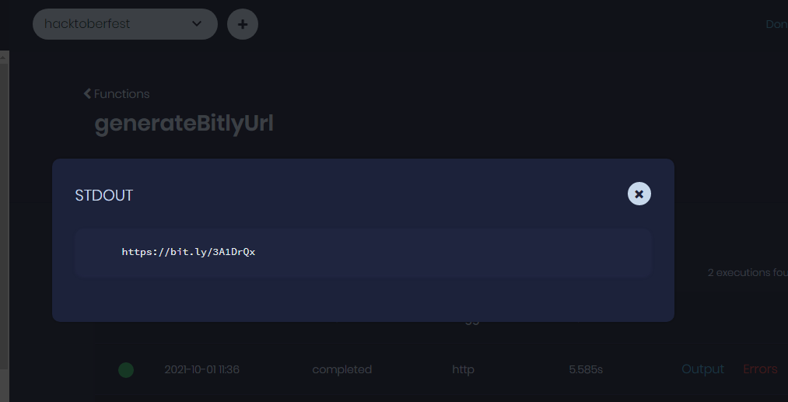
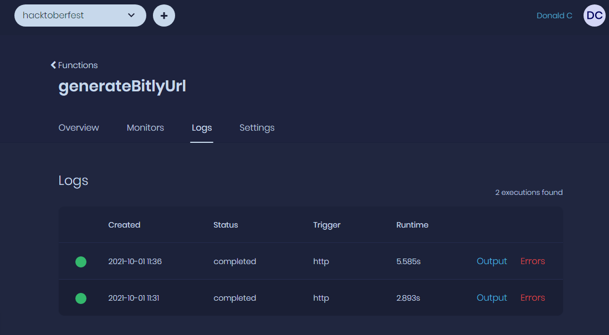
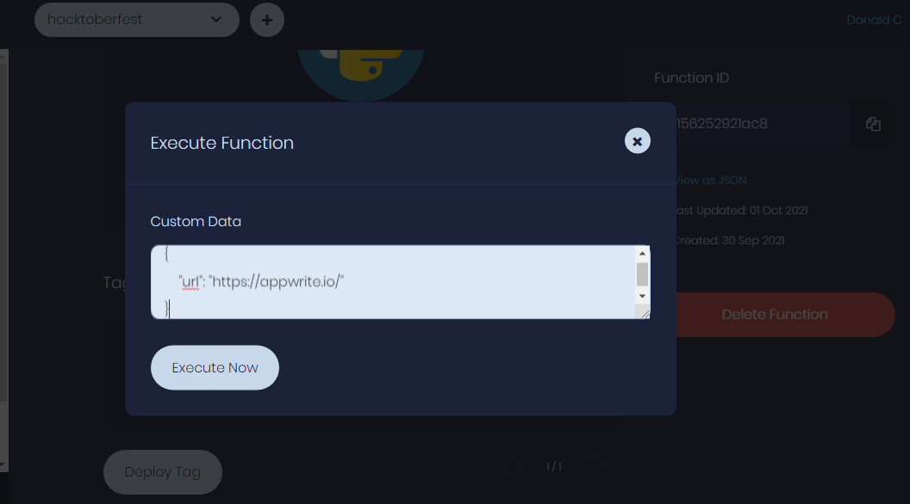
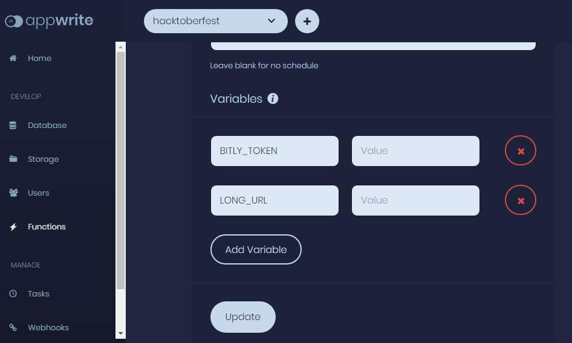

# 🔗 Shorten Long Link
A dart Cloud Function for generating a bitly short link from a passed long url link.

## Dart AW Setup
To setup dart cloud function, follow this excellent tutorial [on dev here](https://dev.to/appwrite/learn-how-to-create-and-run-appwrite-functions-with-dart-5668)

Im using `dart-2.1.3`

<br>
<br>

## 🚀 Result
Here is our very own shortened appwrite generated link

<br>

<br>

<br>
<br>

## 📝 Environment Variables
Go to Settings tab of your Cloud Function. Add the following environment variables.
****
* **BITLY_TOKEN** -  API Key for Bitly

If you are testing from AW console, provide this environment variable
* **LONG_URL** - example long url to shorten
<br>

<br>
<br>

You can use both the `APPWRITE_FUNCTION_DATA` or `APPWRITE_FUNCTION_EVENT_DATA` default environment variables too depending on your use-case.<br>
Consider the scenarios (more info [on aw docs, here](https://appwrite.io/docs/functions#enviromentVariables)):
<br>
<br>

## Scenario 1: `APPWRITE_FUNCTION_DATA`
This variable can be set only when triggering a function using the SDK or HTTP API and the Appwrite Dashboard. <br>
If using this approach, uncomment `TODO: 1` in `main.py` 

<br>
If using this from appwrite console, paste this example code on the popup<br>

```json
{
    "url": "https://appwrite.io/"
}
```
<br>
<br>

## Scenario 2: `APPWRITE_FUNCTION_EVENT_DATA`
Your function event payload. This value is available only when your function trigger is 'event'. This variable value contains a string in JSON format with your specific event data<br>
If using this approach, uncomment `TODO: 2` in `main.py` 
<br>
<br>
Once done, dont forget to confirm your settings on `TODO: 3` and `TODO: 4`

<br>
<br>

## Bitly Account
If you do not have an account already, [register here](https://bitly.com/pages/pricing/v2) for free.
<br>
Once registered, login and go on your dashboard, from there click your account name on the top right corner and go to `settings`
<br>
Under `settings`, scroll to `Developer settings` and click on `API`
<br>
Under this tab, notice the `Access token` menu, enter your account password you used to login / register and client `Generate token`
<br>
After a success, copy the token and paste on your AW console variables as `BITLY_TOKEN`
<br>

<br>
<br>

## 🚀 Building and Packaging

To package this as a cloud function, follow these steps.

```bash
$ cd demos-for-functions/dart/feat-implement-generate-bitly-url-dart

$ export PUB_CACHE=.appwrite/
$ dart pub get
```

* Ensure that your folder structure looks like this 
```
.
├── main.dart
├── .appwrite/
├── pubspec.lock
└── pubspec.yaml
```

* Create a tarfile

```bash
$ cd ..
$ tar -zcvf bitly_url_shortener.tar.gz feat-implement-generate-bitly-url-dart
```

* Navigate to the Overview Tab of your Cloud Function > Deploy Tag
* Input the command that will run your function (in this case `dart main.dart`) as your entrypoint command
* Upload your tarfile 
* Click 'Activate'

## 🎯 Trigger
You can use any event here to enable automatic configuring of this cloud function, just make sure that the payload contains the `url` field so that the function will pick it up as the field containing the long url to shorten